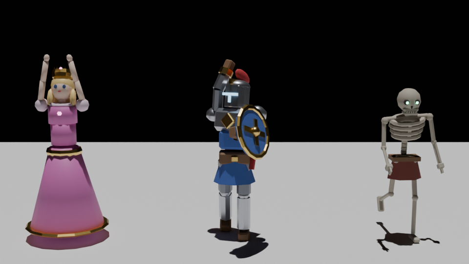

# Le Donjon des Os

Un jeu d'action 3D en vue du dessus : vous incarnez **Sire Aldric**, dernier chevalier de la Garde de l'Aube, qui descend dans le Donjon des Os pour sauver la **princesse Elara**, enlevée par **Morvath, le Roi-Squelette**.

Une partie dure environ **15 à 30 minutes**.



## Lancer le jeu

Le jeu tourne dans le navigateur (Chrome, Edge ou Firefox). Comme il charge des fichiers 3D, il faut passer par un petit serveur web local plutôt que d'ouvrir `index.html` directement.

- **Windows** : double-cliquez sur `lancer_jeu.bat`
- **Mac / Linux** : lancez `./lancer_jeu.sh`

Ces scripts ont besoin de Python, puis ouvrent `http://localhost:8000`. Sans Python, n'importe quel serveur web fait l'affaire, par exemple `npx serve game` avec Node.js.

## Commandes

| Action | Touches |
|---|---|
| Se déplacer | `Z Q S D` (AZERTY), `W A S D` (QWERTY) ou flèches |
| Attaquer | Clic gauche (le coup part vers la souris ; maintenir pour enchaîner un combo de 3 coups) |
| Roulade (invulnérable) | `Espace` ou clic droit |
| Boire une potion | `F` |
| Interagir (coffres, armes, parchemins) | `E` |
| Changer d'arme | `1` à `7`, molette ou `Tab` |
| Carte | `M` |
| Pause | `Échap` |

## Contenu

- **5 zones** : les Caves, la Crypte, l'Ossuaire, les Salles du Roi et le Trône des Os. Les zones sont séparées par des herses qui s'ouvrent quand on a tué tous les squelettes ou trouvé la bonne clé.
- **Ennemis** : guerriers squelettes, archers, chevaliers en armure avec bouclier (une arme contondante passe leur garde), squelettes qui sortent du sol, le Champion squelette, puis le boss Morvath. Morvath a deux phases : il invoque des morts, frappe le sol et lance des salves d'orbes.
- **7 armes** de 4 raretés, trouvées dans les coffres ou lâchées par les ennemis : Épée rouillée, Épée du chevalier, Masse d'armes, Hache de guerre, Lance d'argent, Marteau runique (onde de choc) et **Aube Ardente**, l'épée légendaire qui enflamme les ennemis. Ramasser une arme qu'on possède déjà l'améliore (+15 % de dégâts).
- **Butin** : pièces d'or, potions de soin, fioles de vie (+25 PV max), clés.
- **Histoire** : dialogues, parchemins à lire, points de passage, et une fin avec les statistiques de la partie.

## Comment c'est fait

Blender n'a plus de moteur de jeu intégré depuis la version 2.8. Le travail est donc partagé en deux :

1. **Blender crée tous les modèles 3D et les animations**, par script Python : [`blender/build_assets.py`](blender/build_assets.py). Le script construit les personnages avec un squelette d'animation (armature), anime chaque action image par image, puis exporte le tout en `.glb` dans `game/assets/`.
   - Chevalier : Idle, Run, Attack, Attack2, Roll, Hit, Drink, Die, Victory
   - Squelette : Idle, Walk, Attack, Shoot, Hit, Die, Rise, Roar, Slam
   - Princesse : Idle, Walk, Cheer
   - Armes, coffre (couvercle articulé), herse, cage, torches, piliers, tonneaux, trône…
2. **Le jeu tourne dans le navigateur** avec [Three.js](https://threejs.org) (dossier `game/`). Il charge les fichiers `.glb` de Blender et joue leurs animations.

Pour ouvrir les personnages dans Blender : `blender/personnages.blend`. Appuyez sur Espace dans la vue 3D pour lancer l'animation.

### Régénérer les modèles après une modification

```bash
blender --background --python blender/build_assets.py
# ou, sans installer Blender : pip install bpy==4.2.0 && python3 blender/build_assets.py
```

### Organisation du code

| Fichier | Rôle |
|---|---|
| `game/js/data.js` | Carte du donjon, armes, ennemis, textes de l'histoire |
| `game/js/main.js` | Boucle de jeu, caméra, combat, progression, fin |
| `game/js/actors.js` | Héros, squelettes, boss, projectiles |
| `game/js/world.js` | Sol, murs, torches, herses, coffres, pièges, navigation des ennemis |
| `game/js/loot.js` | Butin au sol |
| `game/js/fx.js` | Particules, éclats d'os, ondes de choc |
| `game/js/audio.js` | Sons et musique générés par le code (Web Audio) |
| `game/js/ui.js` | Interface, dialogues, mini-carte |

Three.js (licence MIT) est inclus dans `game/vendor/` : le jeu fonctionne sans connexion internet.
